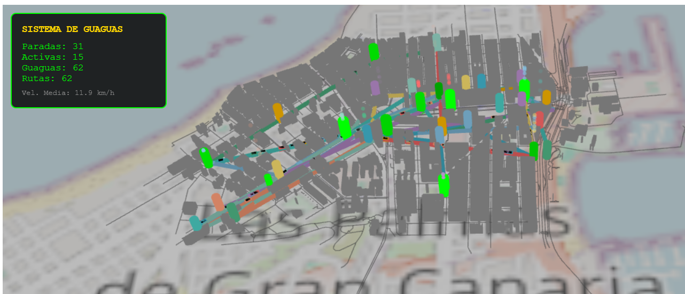

# SistemaDeGuaguasIG
# Sistema 3D de Visualización de Guaguas – Las Palmas de Gran Canaria

Simulación 3D interactiva desarrollada en **Three.js** que representa:

* Las calles reales de Las Palmas (a partir de datos OSM).
* Edificios extruidos en 3D.
* Paradas de guagua con animación por eventos.
* Rutas de transporte público.
* Guaguas en movimiento con orientación.
* Panel de estadísticas en tiempo real.
* Efectos visuales como partículas y pulsos animados.

La aplicación genera una visualización completamente dinámica sobre un mapa base de la ciudad, mostrando cómo las guaguas recorren sus rutas y activan las paradas al llegar la guagua.

---

## Características principales

Renderizado 3D con Three.js
Todo el entorno (calles, edificios, rutas, guaguas, paradas…) se genera mediante geometrías 3D.

**Integración con datos reales de OpenStreetMap (OSM)**
El motor carga un archivo `.osm` que contiene:

* `highway=*` → Carreteras
* `building=*` → Edificios
* `highway=bus_stop` → Paradas de guagua
* `relation[route=bus]` → Rutas de transporte público

Esto permite que la visualización coincida con la geografía real.

**Sistema de guaguas animadas**
Cada ruta genera automáticamente sus guaguas:

* Movimiento continuo entre nodos.
* Orientación automática hacia la dirección de avance.
* Velocidad variable para que no todas vayan iguales.
* Reinicio fluido al final del recorrido.

**Animación de paradas**
Cada parada:

* Detecta si una guagua llega.
* Emite un pulso animado.
* Genera partículas que suben y desaparecen.

**Estadísticas en tiempo real**
Incluye un panel tipo HUD con:

* Nº de paradas
* Nº de paradas activas
* Nº de guaguas
* Nº de rutas cargadas
* Velocidad media de las guaguas

## Generación de edificios 3D

Cada `way` con `building=*` se detecta y se extruye:

1.  Se corrige el sentido de las caras (si es necesario).
2.  Se genera un `ExtrudeGeometry` con una altura fija.
3.  Se coloca sobre el mapa con una ligera elevación para evitar *z-fighting*.
4.  Se aplica un material mate estilo urbano.

---

## Renderizado de carreteras

Cada `way` que tenga un tag con `highway` se convierte en una `THREE.Line` con:

* Color gris asfalto
* Opacidad suave
* Altura mínima

## Controles

* **Botón izquierdo:** Rotar
* **Rueda:** Zoom
* **Botón derecho:** Mover la cámara lateralmente

## Demo en Vivo (CodeSandbox)

